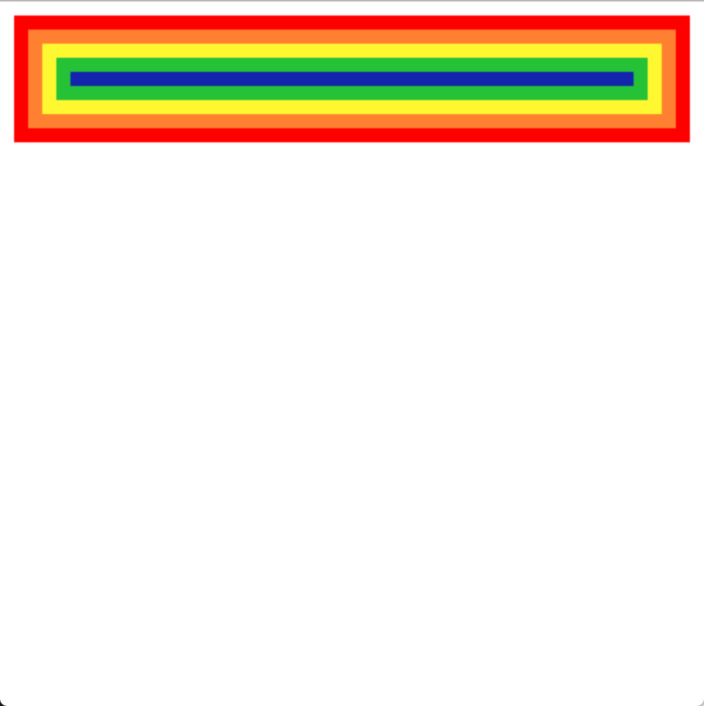
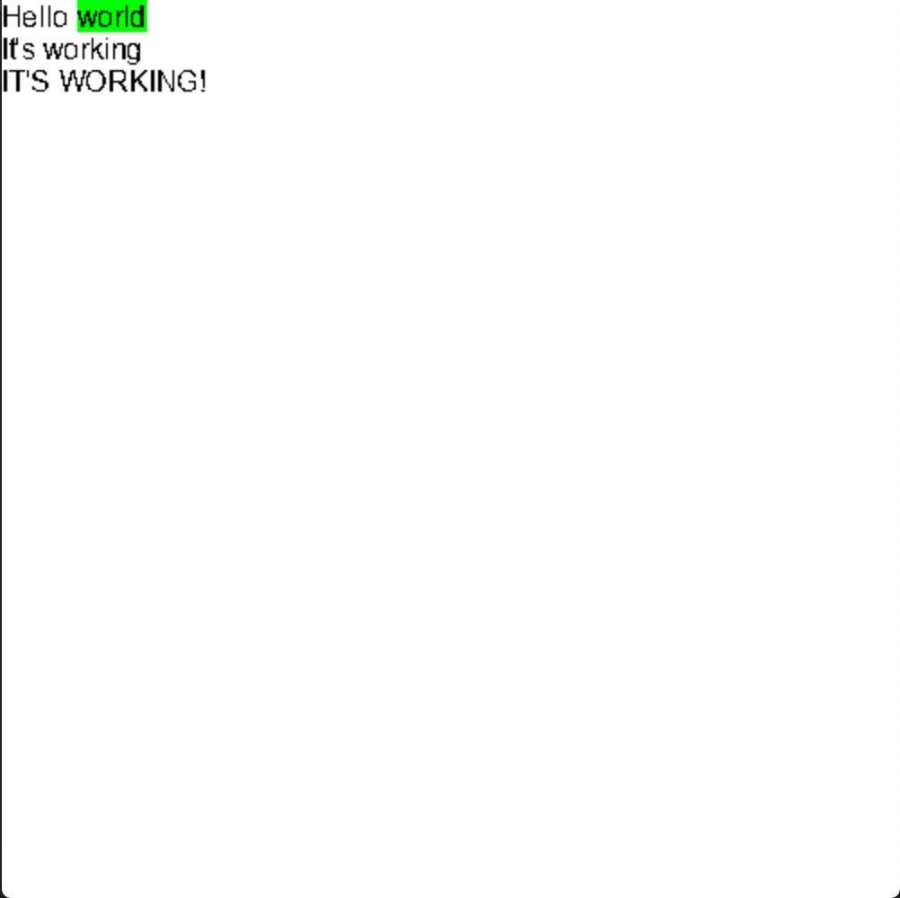

# hot-wheels

Toy browser engine built with C++11, built for learning a bit about the wizardry that is a browser.

This is extremely stripped back, things like JS are a whole other thing which is out of scope of this project. It probably won't even fetch stuff from the web, just feed in input through args. I might come back and look at this if I enjoy the project. 

# Building

```bash
mkdir build
cd build 
cmake ..
make 
```

# Running

From project root, run
```
./hotwheels
```

**Goals** 

**Milestone 1**
- [x] Parse a subset of HTML
- [x] Parse a subset of CSS attributes
- [x] Arrange elements using blocks
- [x] Paint to a window

**Milestone 2**
- [x] Draw Inline Boxes
- [x] Render text in boxes
- [x] Text Sizing
- [x] Style tags

**Project Wrap Up**
- [x] Take files in from command line
- [ ] Create sample to demonstrate what the engine can do


## HTML Subset

Syntax can contain 

- Balanced tags e.g. `<title>...</title>`
- Attributes

## Current State

We have paint! We can paint colored rectangles!!!



We can also draw text! Taking the HTML and CSS:
```html
<!doctype html>
<html>
  <p>Hello <span>world</span></p>
  <p>It's working</p>
  <p>IT'S WORKING!</p>

</html>
```
```css
span {
  background-color: #00ff00ff;
}
```
we produce: 


## How does a browser engine work? 

The main flow of a browser engine follows a pipe and filter system, HTML and CSS files are fed in as input, parsed and combined to produce a set of requirements for each element on the page, we then calculate the position on screen, producing a render tree which is passed to a painter. 


